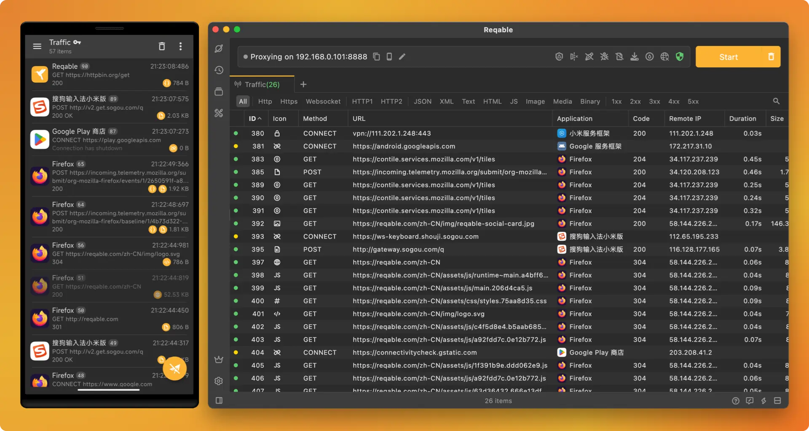
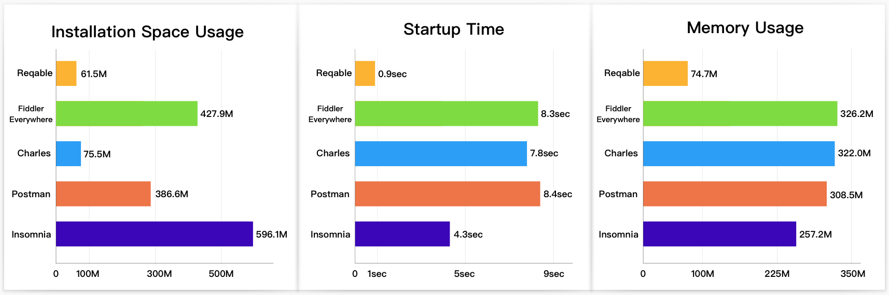

# Reqable

[中文版本](./README_CN.md)

⚠️ **Note: Reqable is a non-open source project, and this repository is only used to manage requirements and user feedback.**

[Reqable](https://reqable.com/) is a new generation API debugging and testing one-stop solution. Reqable fully supports HTTP1 and HTTP2 and partially supports HTTP3(QUIC). Now available on `Windows`, `Mac`, `Linux`, `Android` and `iOS`.



Website: https://reqable.com

## What is Reqable?

**Reqable = Fiddler + Charles + Postman**

Reqable implements the core features of traffic analysis and API testing, and deeply integrates them. One app is worth multiple apps. Reqable is developed based on Flutter and C++ and has great performance advantages compared to similar products.



*The above data was tested on a MacBook Pro 2017. The startup time is calculated by calculating the frame offsets after recording the screen. The memory usage is calculated by after moving the app to the background.*

### 1. API Debugging

Reqable uses the classic MITM proxy method for debugging and supports such as rewriting, scripting (Python), breakpoints, and replay.

- [x] Support HTTP/1.x and HTTP2 protocol, HTTP3 (QUIC) is not supported yet.
- [x] Support HTTP/HTTPS/Socks4/Socks4a/Socks5 proxy mode.
- [x] Support HTTPS, TLSv1.1, TLSv1.2 and TLSv1.3 protocols.
- [x] Support IPv4 and IPv6.
- [x] Support WebSocket upgraded based on HTTP1.
- [x] Support HTTP/HTTPS secondary proxy.
- [x] Composing API: Create REST API from captured traffic list.
- [x] Search and filter: Multi-condition search, application, domain name, protocol, data type and other filters.
- [x] Rewriting: Perform redirection, map local, map remote, modification for requests or responses.
- [x] Breakpoint: Perform real-time breakpoint operations on requests or responses.
- [x] Scripting: Support for writing Python scripts to process requests or responses.
- [x] Gateway: Perform operations such as shielding and suspending for requests or responses.
- [x] Mirroring: Configure mirror mapping for the specified domain name and port.
- [x] Reverse proxy: Use local reverse proxy server to debug HTTPS traffics without trusting CA certificate.
- [x] Highlighting: Set custom rules to highlight requests in multiple colors.
- [x] Replay: Support single or multiple requests for playback testing.
- [x] Diff tool: Compare request and response messages, quickly locate data deviations.
- [x] History: Automatically save the recording list for easy retrospective viewing.
- [x] Traffic source: Detect which application the traffic is coming from.
- [x] HAR: Automatically associate HAR files, and support HAR export and open.
- [x] SSL Certificates: Import custom SSL certificates, analyze pinned certificates and two-way authentication requests.

Screenshot:


### 2. API Testing

Reqable can compose API for testing and also supports features such as API collection and history.

- [x] Supports HTTP/1.1, HTTP2 and HTTP3 (QUIC) protocols.
- [x] API collection: Save API to collections and manage your APIs.
- [x] Collection suppoert: Import collections from Postman and Hoppscotch.
- [x] Environment: Global environment and user environments.
- [x] Batch editing: Support batch editing of query parameters, request headers, forms, etc.
- [x] Scripting: Write python script to process pre-request and post-request data.
- [x] Code Snippet: Generate code for mainstream languages ​​or network libraries such as Python, Java, and NodeJS.
- [x] Authorization settings: Support authorization methods such as API KEY, Basic Auth, and Bearer Token.
- [x] Proxy settings: Support custom proxy, system proxy and debugging proxy, etc.
- [x] Performance: You can view the time-consuming data of requests at different stages.
- [x] Cookie management: Automatically save cookies or add cookies.
- [x] History: Automatically save the request and response for easy retrospective viewing.
- [x] cURL support: Create API from cURL or export API to cURL.

Screenshot:


## Installation

Reqable official website provides the download of the latest version: [Download Now](https://reqable.com/en-US/download). If you want to download the historical version: [Click here](https://github.com/reqable/reqable-app/releases). In addition, on Mac, Reqable provides the `Homebrew` installation.

### Windows Setup

On Windows, you download `Setup.exe` and just follow the setup installation program instructions. There is currently no installation-free version available, mainly because Reqable installation requires writing the registry (associated with `har` and other file formats).

### Mac Setup

On Mac, Reqable provides installation packages for both Apple chip and Intel chip. If you download the DMG file, open it and drag app into the `Applications` folder; if you are using `Homebrew`, please try this command:
```shell
brew install reqable
```

### Linux Setup

The Linux version requires the GTK library. Please confirm whether the system has GTK installed before installation. The Linux installation program is a deb file. We currently only provide the x64 architecture version. You can install it using `apt`:
```shell
sudo apt install reqable-app-linux-x86_64.deb
```

## Mobile App

The Reqable mobile can be used standalone or work with the desktop app. Standalone means that traffic recording and API testing can be performed independently without relying on the desktop. While in collaborative mode, the mobile app could automatically forward traffic to the desktop by scanning the desktop QR code without manually configuring the Wifi proxy.

Get app for free from play store and app store.

<a href="https://play.google.com/store/apps/details?id=com.reqable.android"></a>
<a href="https://apps.apple.com/app/id6473166828"></a>

Screenshots:


*Mobile app implements most of the features on the desktop, except for some with legal risks, such as rewriting.*

## Documentation
https://reqable.com/en-US/docs/introduction

## Thanks

- [leanflutter](https://github.com/leanflutter)
- [highlightjs](https://github.com/highlightjs/highlight.js)
