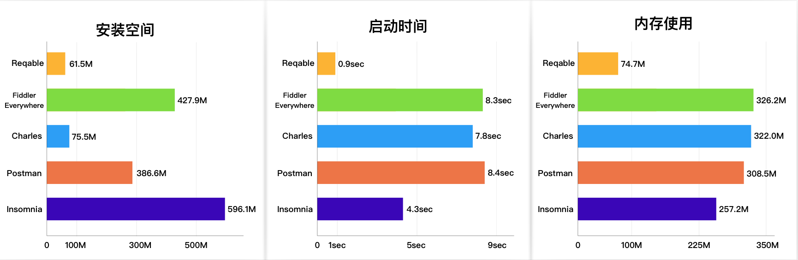

# Reqable

⚠️ **注意：Reqable是非开源项目，本仓库仅用来管理需求和用户反馈。**

[Reqable](https://reqable.com/)是一款跨平台的专业HTTP开发和调试工具，在全平台支持HTTP1、HTTP2和HTTP3(QUIC)协议，简单易用、功能强大、性能高效，助力程序开发和测试人员提高生产力！现已支持Windows、Mac、Linux、Android和iOS五大平台。


官方网站：https://reqable.com

Reqable的特点是简洁美观，基本功能免费，无需登录，安装即用。

- 20M左右的安装包体积。
- 跨平台，基于Flutter和C++开发。
- 支持亮色和暗色两种主题模式。
- 支持11种不同的强调色和15种不同的代码高亮配色方案。

## Benchmark

Reqable基于Flutter和C++开发，相比同类产品具有极大的性能优势。



*以上数据是在MacBook Pro 2017设备上测试，启动时间是通过录屏后计算帧差得出，内存使用为应用启动后直接置于后台再计算得出。*

## 桌面端

Reqable桌面端支持 Windows/Mac/Linux 三大主流平台，具备抓包调试和API测试两大基本功能，可以将其看成是 Fiddler/Charles + Postman。

Reqable打通了API调试和测试之间的壁垒，例如可以从抓包数据中创建API进行测试，也可以在API测试时进行流量抓包分析。

### 1. 流量抓包

Reqable采用经典的MITM代理方式进行流量分析，支持重写、脚本（Python）、断点和重放等功能。

- [x] 支持HTTP/1.x, HTTP2协议版本，HTTP3(QUIC)暂不支持。
- [x] 支持HTTP/HTTPS/Socks4/Socks4a/Socks5代理方式。
- [x] 支持HTTPS，TLSv1.1、TLSv1.2和TLSv1.3加密协议。
- [x] 支持基于HTTP1升级的WebSocket协议。
- [x] 支持HTTP/HTTPS二级代理（调试境外流量）。
- [x] 搜索筛选：提供书签、域名、快捷筛选栏和多条件等高级搜索方式。
- [x] 网关功能：对指定请求或响应进行屏蔽，挂起等操作。
- [x] 重写功能：预设规则对指定请求或响应进行重定向、替换或者修改。
- [x] 断点功能：对请求或响应进行实时断点操作，比如屏蔽，挂起或修改替换数据等。
- [x] 脚本功能：支持编写Python脚本处理实时请求或响应。
- [x] 镜像功能：对指定域名和端口配置镜像映射。
- [x] 测试联动：支持从调试列表创建API进行测试。
- [x] 历史记录：自动保存抓包的流量数据，方便回溯查看。
- [x] 重发回放：支持单个或多个请求进行回放测试。
- [x] 请求对比：支持对比请求和相应数据，快速定位数据偏差。
- [x] 反向代理：项目配置反向代理，免证书授信调试HTTPS流量。
- [x] 自动高亮：支持设定自定义规则对请求进行多种颜色高亮。
- [x] 应用来源：支持流量应用来源显示和筛选，方便检测程序后门。
- [x] HAR支持：自动关联HAR格式文件，并支持HAR导出和导入。

实测截图：


### 2. API测试

Reqable可以编辑和发送HTTP请求，用来测试API接口，同时还支持API集合存储和历史记录等功能。

- [x] 支持HTTP/1.1, HTTP2和HTTP3(QUIC)协议。
- [x] 多个会话：支持创建多个Tab进行API测试。
- [x] API集合：支持创建创建集合目录保存API，可直接导入Postman、Hoppscotch、ApiPost和Apifox等集合。
- [x] 批量编辑：支持批量编辑请求参数、请求头、表单等。
- [x] 授权设置：支持API KEY、Basic Auth和Bearer Token等授权方式。
- [x] 代理设置：支持自定义代理配置，系统代理和调试代理等。
- [x] 性能测试：可以查看请求在不同环节的耗时数据。
- [x] Cookie管理：自动保存Cookie或在请求头中自动加入关联的Cookie。
- [x] 历史记录：自动保存发送的请求和响应数据，方便回溯查看。
- [x] cURL支持：可以导入和导出cURL。

实测截图：


## 下载和安装

Reqable官网提供了最新版本的下载：[点我查看](https://reqable.com/zh-CN/download)。如果希望下载历史版本：[点击这里](https://github.com/reqable/reqable-app/releases)。此外，在Mac系统上，Reqable提供了`Homebrew`的安装方式。

### Windows安装

在Windows上，您下载的是`Setup.exe`，按照Setup安装程序指引即可。目前未提供绿色版本，主要是因为Reqable安装需要写注册表（关联har等文件格式）。

### Mac安装

在Mac设备上，Reqable提供了Apple芯片和Intel芯片两种架构的安装包。如果下载DMG文件，打开后拖拽进`应用程序`文件夹即可；如果是使用`Homebrew`，输入下面命令行即可自动安装：
```shell
brew install reqable
```

### Linux安装

Linux版本依赖GTK库，安装前请确认系统是否已经安装了GTK。Linux安装程序是deb文件，我们目前只提供了x64的架构版本，使用apt安装即可:
```shell
sudo apt install reqable-app-linux-x86_64.deb
```

## 移动端

Reqable移动端支持单独使用，也支持与桌面端协同使用。独立使用指的是可以单独进行流量分析、API请求测试，无需依赖桌面端；而协同模式下，移动端可以通过扫描桌面端的二维码后自动将流量转发到桌面端，无需手动配置Wifi代理，后续操作在桌面端进行。移动端支持桌面端绝大多数功能，除了调试功能担心引起滥用暂未上线。

可以从Play Store和App Store免费获取应用。

<a href="https://play.google.com/store/apps/details?id=com.reqable.android"></a>
<a href="https://apps.apple.com/app/id6473166828"></a>

实测截图：


## 使用文档
https://reqable.com/zh-CN/docs/introduction

## 交流反馈

加我微信，拉你进群。


